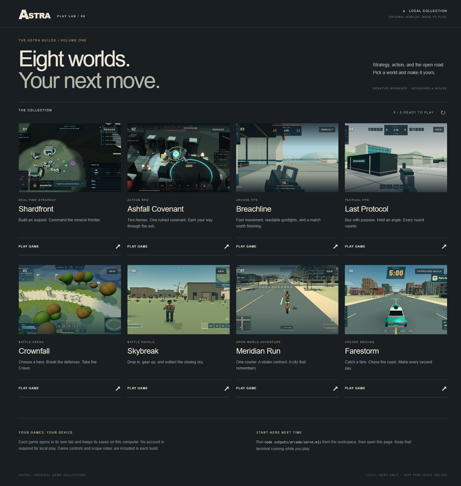

# Astra Oneshots

Eight original browser-game experiments built with Astra, collected behind one local launcher. Shardfront and Ashfall Covenant were remade, Breachline was rebuilt, four additional games were created, and the approved Farestorm build was preserved.

These are playable **local vertical slices**, not complete commercial releases or hosted multiplayer services. The per-game documentation records what works, the evidence, and the larger prompt requirements that remain outside the delivered scope.



## Quick start

Install Node.js **22.x (22.12+) or 24+** with npm, then:

```sh
git clone https://github.com/JamesTsetsekas/astra-oneshots.git
cd astra-oneshots
npm run setup
npm start
```

Open **http://127.0.0.1:4160** and keep the terminal running. A WebGL 2 desktop browser and keyboard/mouse are the verified target. The private repository requires GitHub authentication to clone.

The public GitHub Pages build is available at **https://jamestsetsekas.github.io/astra-oneshots/** after the Pages workflow completes. Pages is a static showcase: each game is built into a relative subdirectory, while the optional Breachline relay remains local-only.

`setup` installs each game's exact lockfile with `npm ci`, then builds its production bundle. Initial setup downloads dependencies and compiles all eight projects; allow several minutes. The launcher serves those generated builds locally. It does not rebuild automatically. Dependencies and `dist` folders are intentionally excluded from Git.

## Games

| Game | Genre | Local port |
| --- | --- | ---: |
| [Shardfront](outputs/shardfront-rts/README.md) | Real-time strategy | 4173 |
| [Ashfall Covenant](outputs/ashfall-covenant-arpg/README.md) | Action RPG | 4174 |
| [Breachline](outputs/breachline-fps/README.md) | Arcade FPS | 4176 |
| [Last Protocol](outputs/last-protocol-fps/README.md) | Tactical FPS | 4177 |
| [Crownfall](outputs/crownfall-moba/README.md) | Lane-and-objective battle arena | 4178 |
| [Skybreak](outputs/skybreak-br/README.md) | No-build battle royale | 4179 |
| [Meridian Run](outputs/meridian-run/README.md) | Open-world courier adventure | 4187 |
| [Farestorm](outputs/farestorm/README.md) | Arcade taxi driving | 4180 |

All eight support local play without an account. Competitive genres use bots for the verified loop. Breachline also has a real optional localhost WebSocket relay, which the launcher starts with its production server. No public matchmaking or hosted game service is included. Saves and settings remain browser-local.

## Development and checks

```sh
npm run install:games  # Install all game lockfiles without building
npm run build         # Rebuild all eight
npm test              # Run all game test suites
npm run verify        # Check production pages/assets/relay; requires npm start running
```

Each game remains an independent npm project. For a single game:

```sh
npm --prefix outputs/meridian-run ci
npm --prefix outputs/meridian-run run dev
npm --prefix outputs/meridian-run test
npm --prefix outputs/meridian-run run build
```

Stop the shared launcher before starting a development server on the same port. Ctrl+C stops only servers started by that launcher; unrelated existing processes are preserved. Never expose these development/local servers as a public multiplayer deployment.

The delivery ledgers record **180 passing automated tests**, successful production builds for all eight games, and browser gameplay checks. This is not cross-browser/hardware certification. Screenshots, repeatable test tools, and scope qualifications are retained with the projects.

- [Collection guide and per-game verification](outputs/GAME-COLLECTION.md)
- [Launcher verification](outputs/arcade/VERIFICATION.md)
- [Original implementation prompt pack](outputs/README.md)

## Assets and repository contents

Source code, original assets, required fonts, screenshots, tests, lockfiles, and verification documents are included. Each project's asset notes describe procedural/generated artwork and third-party components. Existing third-party notices, including font licenses, are retained. No project-wide license has been added.

Local scratch files, dependencies, generated builds, credentials/environment files, and redundant archives are excluded. Publishing this source repository does not deploy the games to a public website.
