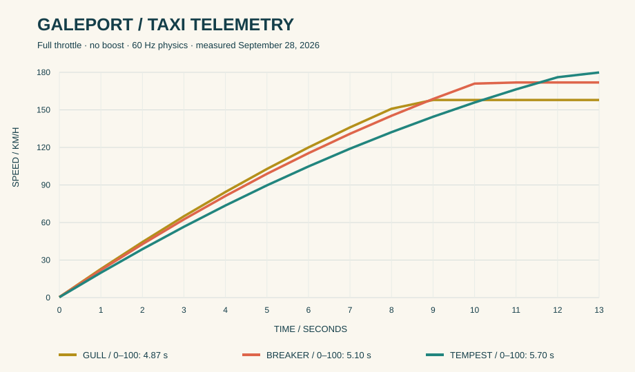

# Handling and score rules

Source values are in `src/game/content.ts` and `src/game/scoring.ts`. Distances are world meters, vehicle speed is meters per second internally and km/h in the HUD.

## Taxi tuning

| Taxi | Speed cap (km/h) | Acceleration tuning | Mass (kg) | Wheelbase (m) | Handling index | Drift index |
| --- | ---: | ---: | ---: | ---: | ---: | ---: |
| Gull Compact | 158 | 7.8 | 1050 | 2.55 | 94 | 94 |
| Breaker Sedan | 172 | 7.5 | 1350 | 2.90 | 83 | 82 |
| Tempest Wagon | 180 | 6.8 | 1700 | 3.10 | 72 | 69 |

Acceleration tuning is an input to the controller, not a measured zero-to-100 time. Handling and drift indices communicate relative tuning, not physical units. The recorded benchmark measured zero-to-100 times of 4.87 seconds for Gull, 5.10 for Breaker and 5.70 for Tempest, with no boost. Regenerate these measurements after controller changes.

Underlying one-second samples and full benchmark settings are in [benchmark-2026-09-28.json](benchmark-2026-09-28.json).

Surge Start uses a 220 ms brake-release/throttle window at low speed. Snap Drift requires travel above 35 km/h; an idle taxi cannot earn drift credit. Grip Turn sequences brake and throttle within a drift. Tailwind spends its meter at 45.46 units per second, so a full 100-unit charge lasts about 2.2 seconds. Boost itself never grants style score.

## Pulse and repeat protection

The Pulse multiplier is 1 below 18, 2 at 18, 3 at 43, and 5 at 72. Every accepted style event adds `12 × repeatReduction` Pulse, capped at 100. It also adds `7.5 × repeatReduction` Tailwind unless boost is active.

For consecutive events of the same category, `repeatReduction = max(0.08, 0.56 ^ repeatCount)`. Varying categories resets the repeat count. Accepted points are `round(base × multiplier × repeatReduction × passengerPreference)`, with a minimum of 1. The default travel guard requires 18 meters and at least one second between repeated keys, with event-specific tuning available. A default speed threshold of 6 m/s rejects slow farming.

After 3.5 seconds without accepted style, Pulse decays by 11 per second. The chain resets when Pulse reaches zero. A hard impact resets Pulse and chain. Softer collisions reduce the active tier. Deliveries add 26 Tailwind independently of style charging.

Near-miss keys include traffic identity. Shortcut progression requires ordered entrance and exit. These state checks belong in the simulation and score modules; a visual smoke effect or landing animation cannot award points by itself.

## Fare breakdown

Deliveries expose the grade, base fare, style tips, precision amount, total payout and awarded seconds through `DeliveryReceipt`. Passenger timers and shift timers are separate. A receipt is informational and does not pause driving for its visual duration.

The base fare is `round(220 + legalRouteMeters × 2.6)`. Passenger par time is `clamp(legalRouteMeters / 15.5 + 18, 25, 80)` seconds. Grade thresholds are BLAZING at 25% remaining patience, FAST at 10%, CLOSE while still positive and LATE during the personal grace window. Arrival requires a low-speed stop in the destination ring.

Time-based cash bonus is `round(baseFare × max(0, remaining / par) × 0.65)`. Precision cash is `round(250 × (1 - distanceToCenter / arrivalRadius))`. Style points are banked when earned; the receipt shows the trip's style tips for context and does not add them a second time. Arcade delivery seconds are grade bonus 3/2/1/0 plus tier bonus 1/2/3; the Shift Clock is capped at 120 seconds. Quick Shift never extends the clock.

School ends in a result when its objective is complete. Trials automatically hand off the next passenger in their fixed destination chain and finish at the chain's final arrival. Trial selection forces its listed seed, independent of random Arcade Shift seeds.

## Trial routes

| Trial | Seed | Destination IDs | Gold / Silver / Bronze (seconds) |
| --- | ---: | --- | --- |
| Harbor Hustle | 73411 | 0, 20, 1 | 115 / 150 / 195 |
| Sunward Express | 98103 | 31, 2, 7 | 150 / 185 / 225 |
| Crown Connection | 51829 | 10, 22, 5 | 145 / 185 / 230 |
| Lantern Afternoon | 13577 | 11, 6, 25, 17 | 170 / 210 / 240 |
| Skyline Sprint | 61049 | 21, 28, 9, 18 | 180 / 220 / 240 |
| Galeport Grand Tour | 99241 | 20, 12, 4, 29, 14 | 190 / 225 / 240 |

Keep fixed seeds stable when comparing tuning. A change to vehicle forces, traffic behavior or fare timing changes the meaning of previous medals and should accompany a rules-version change before verified competition is introduced.
